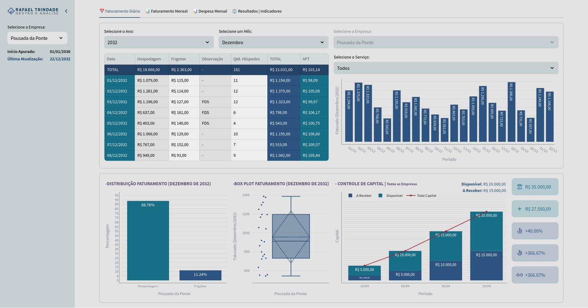
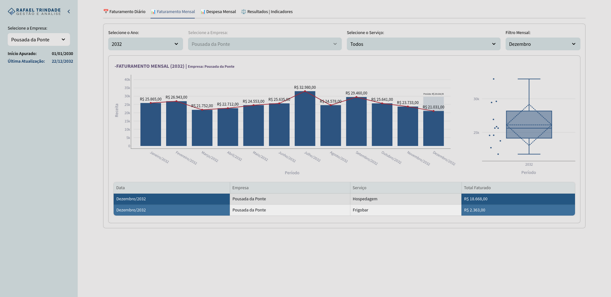
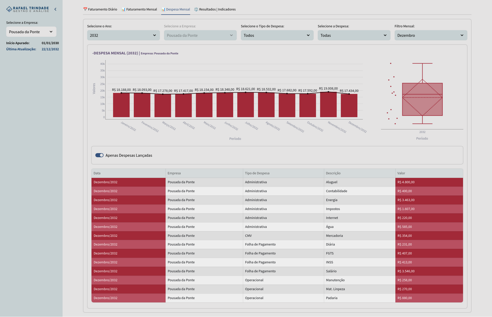
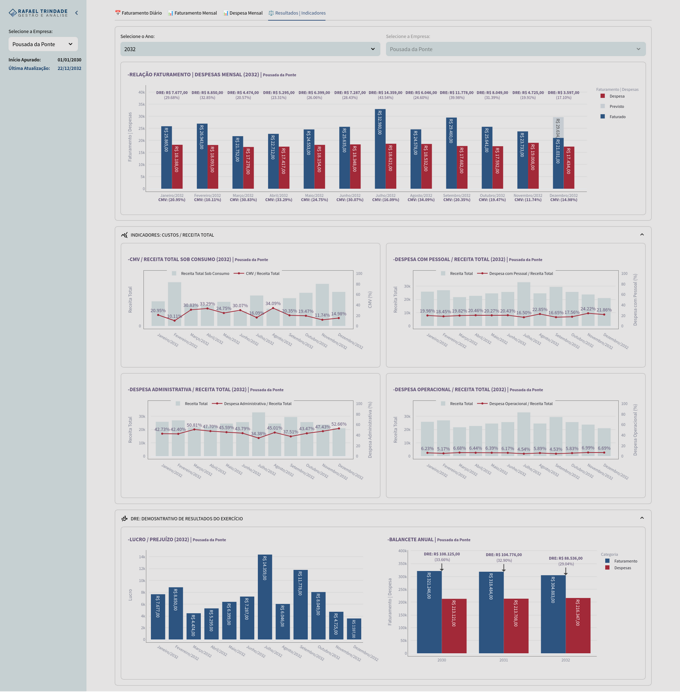
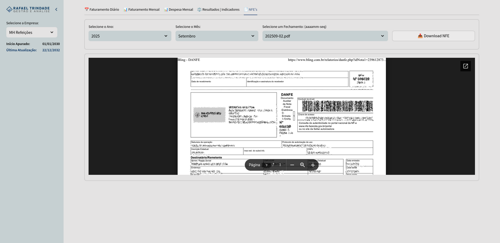

# Gestão e Análise | Rafael Trindade

Plataforma proprietária de análise e gestão financeira de múltiplos negócios com indicadores estratégicos. Permite acompanhar faturamento, despesas e operações por empresa, com visualizações interativas para tomada de decisão. Versão com dados fictícios gerados por [`datafaker-rafatrindade`](https://github.com/rafa-trindade/datafaker-rafatrindade) para portfólio.

## 📈 Funcionalidades Principais

1. **Análise de Faturamento**
   - Visualização diária e mensal
   - Filtros por empresa e serviço
   - Previsões e tendências

2. **Controle de Capital**
   - Acompanhamento de disponibilidades
   - Valores a receber
   - Variações percentuais

3. **Análise de Despesas**
   - Categorização de gastos
   - Comparativos mensais
   - Indicadores de CMV

4. **Indicadores de Desempenho**
   - DRE simplificado
   - Margens e resultados
   - Análises comparativas
   - Métricas de desempenho e KPIs

## 📊 Origem dos Dados:

- **faturamento.csv**: Registros de vendas e receitas
- **despesas.csv**: Registros de gastos e custos
- **controle_capital.csv**: Controle de fluxo de caixa

Todos os dados e documentos são obtidos automaticamente a partir do drive corporativo, utilizando a API do Google Drive via secrets para leitura de arquivos no formato CSV e acesso seguro aos documentos armazenados.

## ⚙️ Tecnologias e Bibliotecas

O projeto utiliza um conjunto de ferramentas para automação, requisição, tratamento e análise de dados:

- [**pandas**](https://pypi.org/project/pandas/) → manipulação e estruturação de dados tabulares  
- [**plotly**](https://pypi.org/project/plotly/) → visualizações interativas  
- [**streamlit**](https://pypi.org/project/streamlit/) → criação de dashboards web  
- [**Google Drive API**](https://developers.google.com/drive) → acesso, leitura e gerenciamento de documentos e planilhas armazenados no Google Drive  

## 📸 Capturas de Tela

#### - Painel Inicial

#### - Painel Faturamento

#### - Painel Despesas

#### - Painel DRE e Indicadores

#### - Painel NFE

